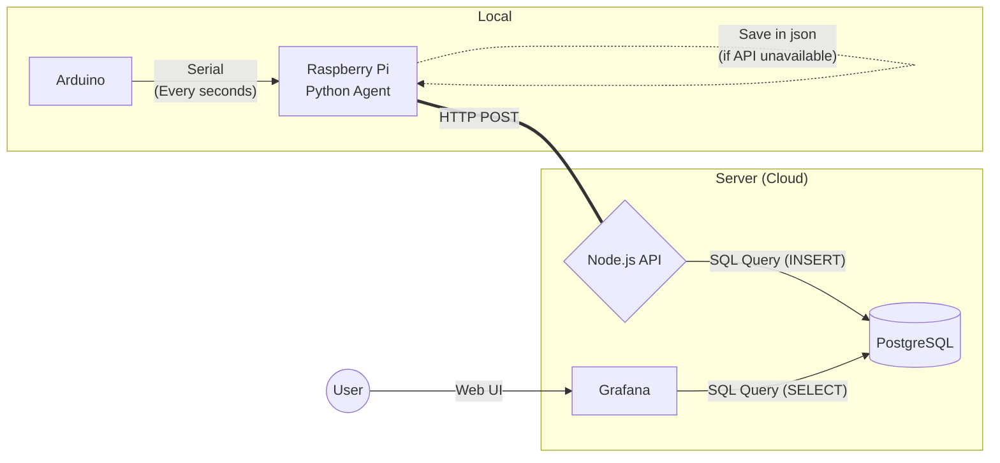

# mnemosyne

mnemosyne is the public implementation of my personal project, `mnemosyne.47`.

Originally designed for weather data tracking, its highly modular architecture allows you to log and analyze statistics for virtually anything (e.g., PC system monitoring, IoT sensors, etc.).

It is highly recommended to deploy this project using Docker containers (a pre-configured `docker-compose.yml` file is provided). Additionally, integrating Grafana for data visualization is an excellent fit and strongly advised.

## 📂 Repository Structure
- `api/` : A Node.js API that serves as the interface for the database.
- `arduino/` : Arduino firmware used for physical measurements (temperature, humidity).
- `raspberry/` : Raspberry Pi scripts designed to collect data from the Arduino and forward it to the API.
- `docker-compose.yml` : The configuration file to deploy the API and the PostgreSQL database (and optionally Grafana). Contains profiles for Raspberry Pi agent and also emulator for testing purposes.

## ☁️ Example Use Case



## 🚀 Deployment

### Prerequisites & Tools
To generate secure API keys, you can use openssl:

```bash
openssl rand -hex 32
```

### Deploying the API and Database

1. Review the `docker-compose.yml` file
2. Create a `docker-compose.override.yml` file to customize the services for your environment.
3. Copy the `.env.example` file to `.env` and configure your environment variables:
  - `DB_PASSWORD` : The password for your PostgreSQL database.
  - `API_KEYS` : Provide one or multiple API keys (comma-separated) to secure access to the API.
4. You can change the database schema in order to create additional tables for different types of data by editing the `./api/src/config/schema.ts` file. Initially, it contains a simple schema for weather data, but you can modify it to fit your specific use case.
5. Start the services using Docker Compose:

```bash
docker compose up -d --build
```

If you want to include Grafana, you should create a `grafana` user and set this password with this command:
(replace grafana_password with a secure password of your choice)

```bash
docker exec -it mnemosyne-db psql -U mnemosyne -d mnemosyne -c "
CREATE ROLE grafana WITH LOGIN PASSWORD 'grafana_password';
GRANT CONNECT ON DATABASE mnemosyne TO grafana;
GRANT USAGE ON SCHEMA public TO grafana;
GRANT SELECT ON ALL TABLES IN SCHEMA public TO grafana;
ALTER DEFAULT PRIVILEGES IN SCHEMA public GRANT SELECT ON TABLES TO grafana;
"
```

### Deploying Raspberry Pi Agent or Emulator

1.Review the `docker-compose.yml` file and ensure the Raspberry Pi agent or emulator profile is correctly configured.
2. Copy the `.env.example` file to `.env` and configure your environment variables:
  - `API_URL` : The URL of the API endpoint where the Raspberry Pi agent or emulator will send data.
  - `API_KEY` : The API key that the Raspberry Pi agent or emulator will use to authenticate with the API.
  - `SERIAL_PORT` : (For Raspberry Pi agent) The serial port to which the Arduino is connected (e.g., `/dev/ttyACM0`).
3. Start the Raspberry Pi agent or emulator using Docker Compose with the appropriate profile or start only the agent or emulator service:

#### For the serial agent (Raspberry Pi)

```bash
docker compose up -d --build mnemosyne-agent-serial
```

#### For the emulator

```bash
docker compose up -d --build mnemosyne-agent-emulator
```

## 📄 Documentation

### API Endpoints

- GET `/` : Shows a welcome message
- GET `/health` : Health check endpoint to verify if the API is running (return a `200` with `OK` if healthy)
- GET `/live/<table_name>` **(requires API key)** : Retrieves the most recent entry from the specified table
- POST `/data/<table_name>` **(requires API key)** : Adds a new entry to the specified table. The request body should be a JSON object containing the data to be stored, with keys corresponding to the column names in the database.
- GET `/export/<table_name>` **(requires API key)** : Exports all data from the specified table in CSV format.

For the routes that require an API key, you need to include an `x-api-key` header in your request with one of the valid API keys you configured in the `.env` file.

### Raspberry Pi

The Raspberry Pi agent is designed to send the data collected from the Arduino to the API. If the API is unreachable, it will store the data locally and attempt to resend it later.
